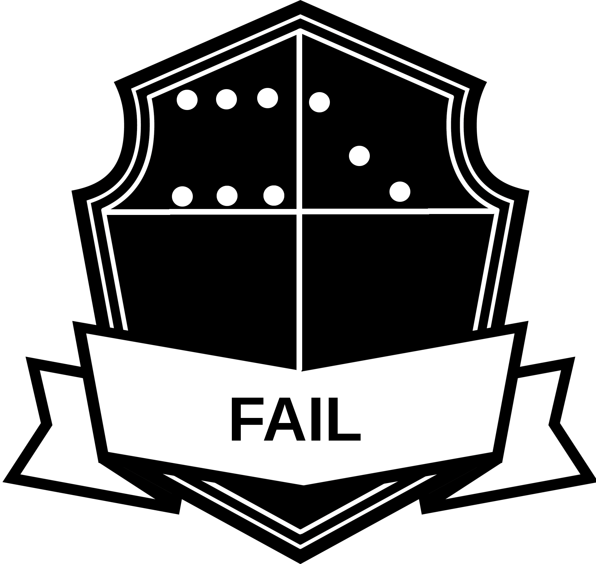
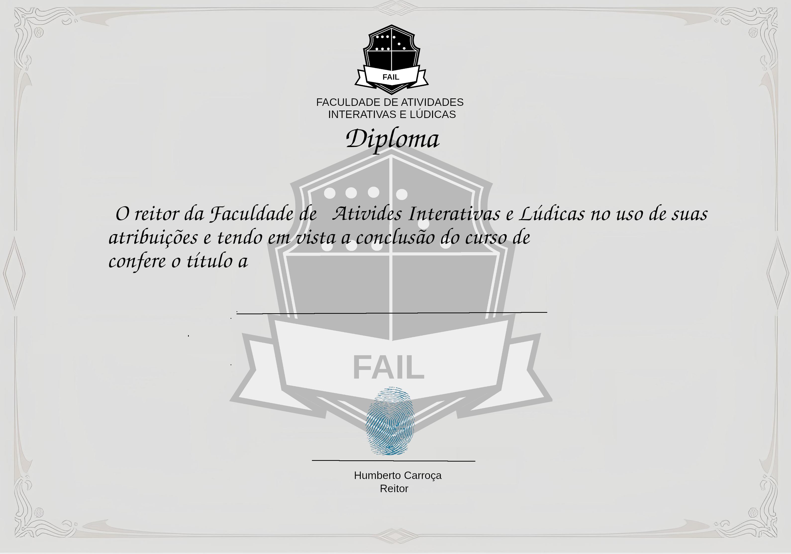

<div align="center">  

# Faculdade de Atividades Interativas e Lúdicas 📁 

</div>




[](https://skillicons.dev)

> Resumo do Projeto: 
Landing page falsa da faculdade F.A.I.L. (Faculdade de Atividades Interativas e Lúdicas) com o intuito de fazer uma brincadeira gerando certificados falsos, e treinar um pouco minhas skills.

## 🎯 Implementações/Features

- [x] Começando
- [x] Resolvendo Bugs
- [x] Projeto Finalizado

## 📕 Como subir localmente?

1. Faça o clone desse repositorio.

```bash
git clone https://github.com/waltenne/fail.git
```
2. Entre no diretorio e instale os requisitos.

```bash
cd fail
pip install -r requirements.txt
```
3. Execute o código.

```bash
python fail.py
```

## 📝 Modelo do Certificado



## 📝 Como customizar o certificado?

1. Crie um novo modelo no [Canva](https://www.canva.com/pt_br/criar/certificados/), ou no editor de sua preferência.
2. Abra o arquivo "fail.py" e faça as seguintes alterações:
  - Defina a altura necessária para escrever o nome, mude a variavel "altura";
  - Opcional mudar a fonte para utilizada para escrever o nome, mude a variavel "fonte";


## 🤝 Colaboradores

Agradecemos às seguintes pessoas que contribuíram para este projeto:
* ChatGPT
* Bard
* Eu mesmo
